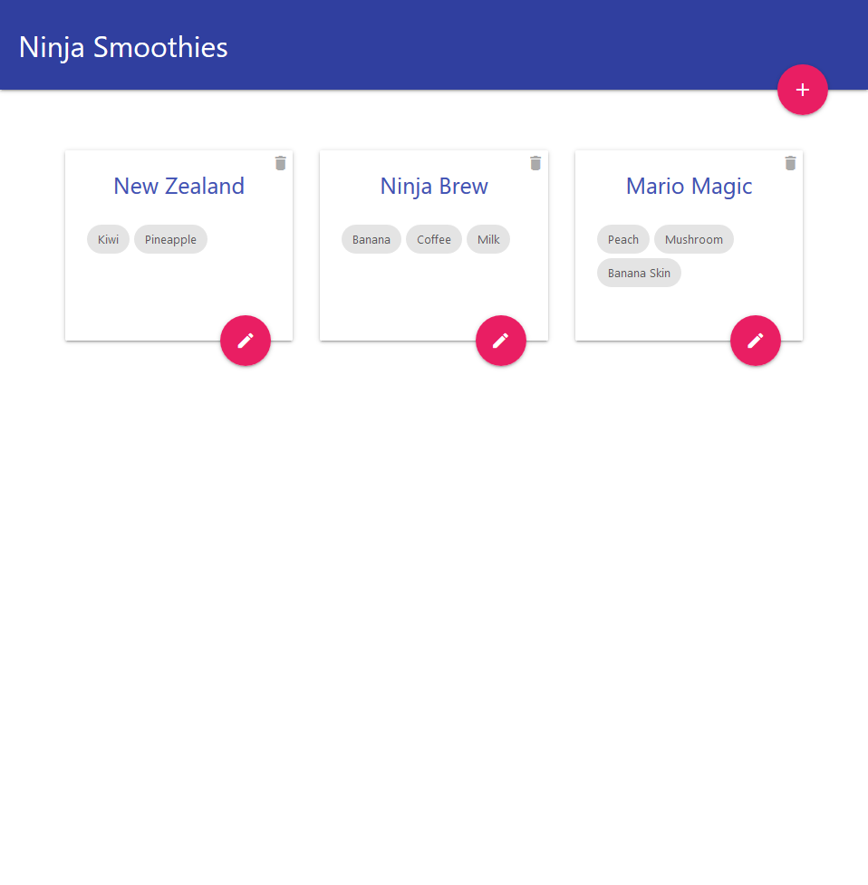

# Recipes Smoothies App

Hi, this is an application for keeping a list of smoothie recipes. From the home page, a few example of recipes are provided. The user can edit the recipes with the pencil icon below each recipe. The user can also add a recipe with the '+' button in the upper right conner of the home page. Between each ingredient, tap 'Tab' key to add an extra ingredient,

## Live Demo

You can try it out [here](https://ninja-smoothies-1bba1.web.app/).

## Screenshots




## Dependencies 

- Node.js 
- Firebase (Hosting, Firestore)
- Vue.js
- [Materialize CSS](https://materializecss.com/)
- [Slugify](https://www.npmjs.com/package/slugify)

---

## Build Setup for Vue.js

``` bash
# install dependencies
npm install

# serve with hot reload at localhost:8080
npm run dev

# build for production with minification
npm run build

# build for production and view the bundle analyzer report
npm run build --report
```

For a detailed explanation on how things work, check out the [guide](http://vuejs-templates.github.io/webpack/) and [docs for vue-loader](http://vuejs.github.io/vue-loader).
